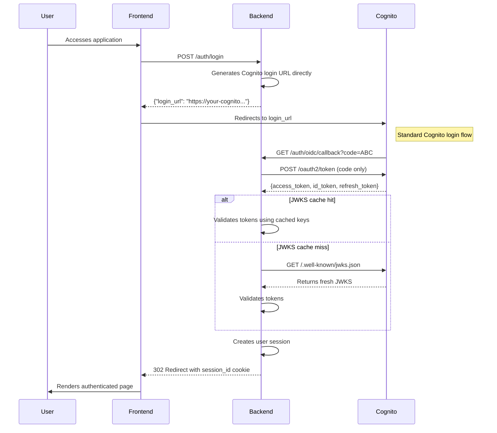
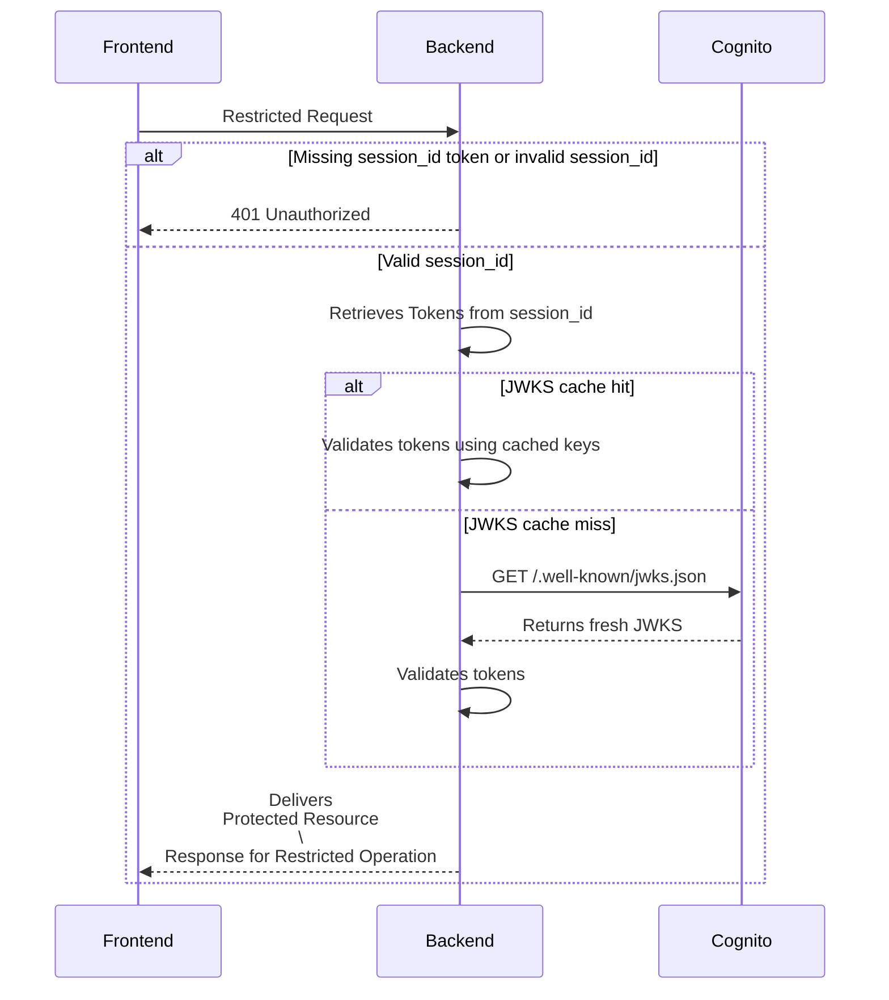
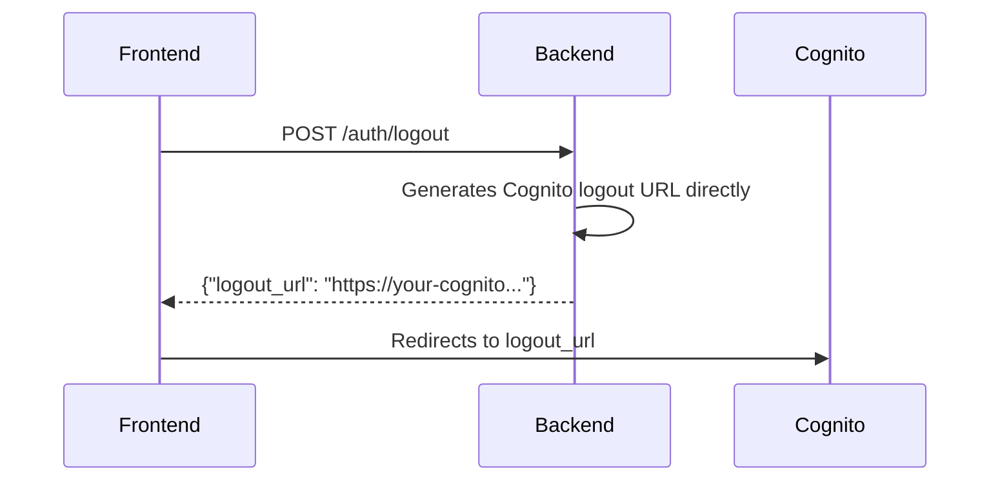

# FullStack Task Manager (Django + Vue)

[](https://www.djangoproject.com/)
[](https://vuejs.org/)
[](https://www.mysql.com/)

[](LICENSE)

## 📌 Overview

Complete task management application featuring:

- **Backend**: Django REST Framework API
- **Frontend**: Vue.js 3 with Vuetify
- **Key Features**:
  - [x] Full CRUD task operations
  - [x] Authentication with Amazon Cognito (OIDC-compliant)
  - [ ] Automated Render deployment (in progress)
  - [ ] OpenAI integration

## 🛠️ Tech Stack

### Backend
- **Django 5.2** - Python web framework
- **DRF** - REST API construction
- **MySQL 8.4** - Database (Docker recommended)
- **DRF Spectacular** - Swagger/OpenAPI docs
- **Pytest** - Test coverage >90%

### Frontend
- **Vue 3** - Composition API
- **Vuetify 3** - Material Design components
- **Axios** - API communication

### DevOps
- **Docker** - Containerization
- **GitHub Actions** - CI/CD pipeline
- **Render** - Cloud deployment

## 🛠️ Prerequisites

### For Docker Setup (Recommended)
- [Docker](https://docs.docker.com/get-docker/)
- [Docker Compose](https://docs.docker.com/compose/install/)

### For Hybrid Setup (Optional)
- **Backend**:
  - [uv](https://docs.astral.sh/uv/getting-started/installation) (alternative to pip)
  
- **Frontend**:
  - [Node.js](https://nodejs.org/) 22+
  - [bun](https://bun.sh/) (or npm/yarn/pnpm)

- **Database**:
  - MySQL 8.4 (via Docker recommended)

## 🚀 Getting Started

### General Setup
```bash
git clone https://github.com/your-user/task-manager.git
cd task-manager
cp frontend/.env.example frontend/.env
cp backend/.env.example backend/.env
docker compose -f docker-compose.dev.yaml up -d
```

### Backend Setup
```bash
# Inside /backend
uv sync --all-extras --dev
uv run src/manage.py migrate
uv run src/manage.py runserver
```

### Frontend setup (with `bun`)
```bash
# Inside /frontend (in another terminal)
bun install --no-save
bun run dev
```

### Frontend setup with other package managers**
```bash
# Inside /frontend (in another terminal)

# With npm
npm install
npm run dev

# With yarn
yarn install
yarn run dev

# With pnpm
pnpm install
pnpm run dev
```

**Access:**
- Frontend: http://localhost:3000
- Backend API: http://localhost:8000
- API Docs: http://localhost:8000/docs

## Cognito Authentication

### Required Setup

**Cognito Setup**

- Configure a User Pool in Amazon Cognito
- Add the callback endpoints to the Allowed Callback Urls in Cognito console

**Cognito settings**
Add in your environment variables for the backend
```env
COGNITO_CLIENT_ID=
COGNITO_CLIENT_SECRET=
COGNITO_DOMAIN=
COGNITO_USER_POOL_ID=
```
Where:
- COGNITO_CLIENT_ID: The client id of your cognito app
- COGNITO_CLIENT_SECRET: The client secret of your cognito app
- COGNITO_DOMAIN: The cognito domain of your user pool
- COGNITO_USER_POOL_ID: The id of your user pool


**URLs for redirection**
```env
BASE_URL=http://localhost:8000
FRONTEND_HOME_URL=http://localhost:3000
```

Where:
- BASE_URL: The base url of your backend
- FRONTEND_HOME_URL: The url of the home of your frontend

### Setting Up User Session

### Handling Restricted Requests

### Logout


## Troubleshooting

### "Having trouble installing mysqlclient?"
Refer to the official installation guide for your platform:
- [mysqlclient PyPI documentation](https://pypi.org/project/mysqlclient/)
- [MySQL official connectors](https://dev.mysql.com/doc/connector-python/en/)

For most Linux systems, you'll need to install system dependencies first.

## 🌐 Coming Soon
- [ ] Live Demo on Render
- [ ] OpenAI integration tutorial

## 📄 License

MIT